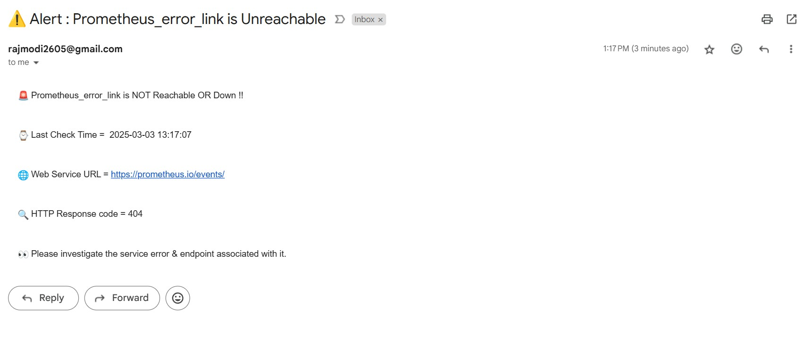

# Web Service Endpoints Health Checker

The objective of this Project is to continuously check multiple web service endpoint health and get an email alert if any endpoint is either unreachable or any error, exception occurs.
<br>

## Technology Used for the Project

- Python

- SMTP

- Linux
<br>

## Prerequisites
Genrate App Password for Trigger email on Gmail OR your Chosen email platform. 

Here, I used Gmail for gettting email alert.

1. Login into Gmail Account
2. Go to **Manage your Google Account**
3. Select **Security**
4. Enable Two-Step Verification
5. Once 2-Step Verification is enabled, return to the Security tab
<br> Scroll down and click on App Passwords.
6. Generate an App Password
7. Copy App Password (16-character app password) immediately as it can only be viewed once.
<br> Save it somewhere safe.

<br>


## Initial Steps
1. Add email key in Linux environment variable

```bash
export email_password="wnfunops********"
```

<br>

2. Varify email key in environment variable

```bash
echo $email_password

wnfunops********
```
<br>

3. Make Script Executable 
```bash
cd SRE_Scripts/Web_Service_Health_Checker 

sudo chmod +x Web_Service_Health_Checker.py
```

<br>

4. Run it
```bash
source ~/py_envs/bin/activate

python Web_Service_Health_Checker.py
```
<br>


## Demonstration
``` bash
2025-03-03 11:56:13.898211 : Jenkins Service is Healthy

Web Url : http://192.168.152.128:8080

Response time : 0.01085

= = = = = = = = = = = = = = = = = = = = = = = = = = = = = = = = = = = = = = = = = = = = = = = = = = = = = = = = = = =


2025-03-03 11:56:13.912291 : Prometheus Service is Healthy

Web Url : http://192.168.152.128:9090

Response time : 0.008168

= = = = = = = = = = = = = = = = = = = = = = = = = = = = = = = = = = = = = = = = = = = = = = = = = = = = = = = = = = =
/root/py_envs/lib/python3.12/site-packages/urllib3/connectionpool.py:1097: InsecureRequestWarning: Unverified HTTPS request is being made to host 'github.com'. Adding certificate verification is strongly advised. See: https://urllib3.readthedocs.io/en/latest/advanced-usage.html#tls-warnings
  warnings.warn(


2025-03-03 11:56:14.887005 : GitHub Service is Healthy

Web Url : https://github.com/

Response time : 0.598311

= = = = = = = = = = = = = = = = = = = = = = = = = = = = = = = = = = = = = = = = = = = = = = = = = = = = = = = = = = =
/root/py_envs/lib/python3.12/site-packages/urllib3/connectionpool.py:1097: InsecureRequestWarning: Unverified HTTPS request is being made to host 'prometheus.io'. Adding certificate verification is strongly advised. See: https://urllib3.readthedocs.io/en/latest/advanced-usage.html#tls-warnings
  warnings.warn(


2025-03-03 11:56:16.193711 : Prometheus_error_link is NOT Reachable !!

Web Url : https://prometheus.io/events/

HTTP Status Code : 404

Response Time : 1.278256

Email alert sent successfully.

= = = = = = = = = = = = = = = = = = = = = = = = = = = = = = = = = = = = = = = = = = = = = = = = = = = = = = = = = = =


2025-03-03 11:56:41.754163 : Not_exist_url Service Fetching Error!

Web Url : https://192.168.254.254/

HTTPSConnectionPool(host='192.168.254.254', port=443): Max retries exceeded with url: / (Caused by NewConnectionError('<urllib3.connection.HTTPSConnection object at 0x7ec5c8b012b0>: Failed to establish a new connection: [Errno 111] Connection refused'))

Email alert sent successfully.

= = = = = = = = = = = = = = = = = = = = = = = = = = = = = = = = = = = = = = = = = = = = = = = = = = = = = = = = = = =


* * * * * * * * * * * * * * * * * * * * * * * *

⌛ Rechecking in 15 Seconds.......

* * * * * * * * * * * * * * * * * * * * * * * *


2025-03-03 11:57:01.573744 : Jenkins Service is Healthy

Web Url : http://192.168.152.128:8080

Response time : 0.013925

= = = = = = = = = = = = = = = = = = = = = = = = = = = = = = = = = = = = = = = = = = = = = = = = = = = = = = = = = = =


2025-03-03 11:57:01.583842 : Prometheus Service is Healthy

Web Url : http://192.168.152.128:9090

Response time : 0.00181

.
.
.
.
.
```
<br>


### Email Alert IF web service is Unreachable

<br>
<br>


### Email Alert IF web servicce exception occurs


<br>


## Scope of Application
- The Script Can be tringger with desired frequency with  <code style="color : red">**CronJob**</code>
<br>
<br>

- It can be also use as a <code style="color : red">**Linux Web Health Check Service**</code>
<br>
<br>

- The Script can integrate with any <code style="color : red">**Monitoring Platfroms**</code> to continuously check web Health Check every few minutes or seconds.